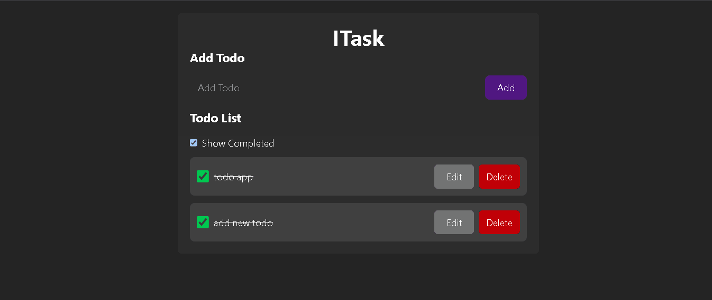

# 🚀 React Todo App

A simple yet powerful Todo List application built with React, Vite, and modern JavaScript. Manage your tasks effortlessly with features like adding, editing, deleting, and toggling completion status. Tasks are persisted in localStorage for seamless continuity across sessions! 📝✨

## 📸 Demo

Check out the live demo: [React Todo App](https://react-todo-app-nine-orpin.vercel.app/)



## ✨ Features

- **Add New Todos**: Quickly add tasks with a user-friendly input form.
- **Edit Tasks**: Modify existing todos directly from the list.
- **Mark as Complete**: Toggle tasks as completed with visual strikethrough.
- **Delete Todos**: Remove unwanted tasks with one click.
- **Filter Completed**: Option to show/hide completed tasks.
- **Local Storage**: All data is saved locally in your browser – no backend required! 💾
- **Responsive Design**: Clean, modern UI that works on desktop and mobile.

## 🛠️ Tech Stack

- **React** (with Hooks: useState, useEffect, useContext)
- **Vite** (Fast development server and bundler)
- **Tailwind CSS** (For styling – utility-first CSS framework)
- **LocalStorage API** (For data persistence)
- **ESLint** (Code quality and consistency)

## 📦 Installation

1. Clone or download the repository:
   ```
   git clone https://github.com/haiderali0509/react-todo-app.git
   cd react-todo-app
   ```
2. Install dependencies:
   ```
   npm install
   ```
3. Start the development server:
   ```
   npm run dev
   ```
   Open [http://localhost:5173](http://localhost:5173) in your browser.

## 🚀 Usage

1. **Add a Todo**: Type your task in the input field and hit Enter or click Add.
2. **Edit a Todo**: Click the "Edit" button on a task – it will populate the input for editing.
3. **Complete a Todo**: Check the checkbox next to the task.
4. **Delete a Todo**: Click the "Delete" button to remove it.
5. **Toggle View**: Use the "Show Completed" checkbox to filter the list.


## 🤝 Contributing

Feel free to fork the repo, make improvements, and submit a pull request!

## 📄 License

This project is open-source and available under the MIT License.

## 🙏 Acknowledgments

Built with ❤️ using React and Vite. Thanks to the open-source community!

---

_Happy Task Managing! 🎉_
